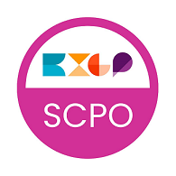
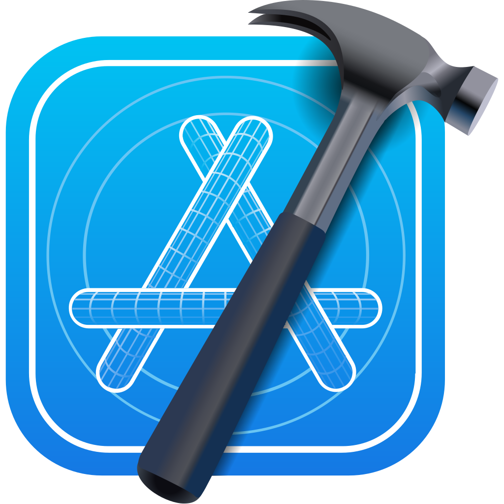
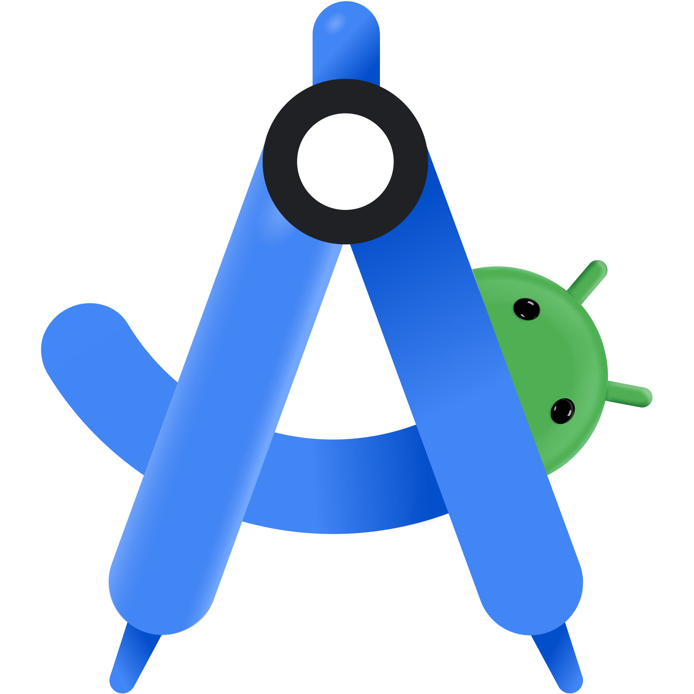

# 👋 Hi, I'm Jesús

Senior QA Mobile & Automation Engineer with focus on  **end-to-end testing** and **CI** for Android and iOS.

## 🧠 Current Technical Focus

- Mobile E2E Manual Testing (Android, iOS)
- Mobile E2E Automated Testing (Appium, Cucumber)
- Mobile CI/CD
- Test reporting & coverage automation
- Agile testing mindset in mobile teams

## 📜 Certifications

<table align="center">
  <tr>
    <td align="center">
            </td>
    <td align="center">
        
    </td>
    <td align="center">
        
    </td>
    <td align="center">
        
    </td>
  </tr>
</table>

## 🛠️ Tech Stack

<table align="center">
  <tr>
    <td align="center">
       
    </td>
    <td align="center">
       
    </td>
    <td align="center">
       
    </td>
    <td align="center">
       
    </td>
    <td align="center">
       
    </td>
    <td align="center">
       
    </td>
  </tr>

  <tr>
    <td align="center">
       
    </td>
    <td align="center">
       
    </td>
    <td align="center">
       
    </td>
    <td align="center">
       
    </td>
    <td align="center">
       
    </td>
    <td align="center">
       
    </td>
  </tr>
</table>

## 📫 Contact & Profile

<table align="center">
  <tr>
   <td align="center">
      
    </td>
    <td align="center">
      
    </td>
    <td align="center">
      
    </td>
  </tr>
</table>
